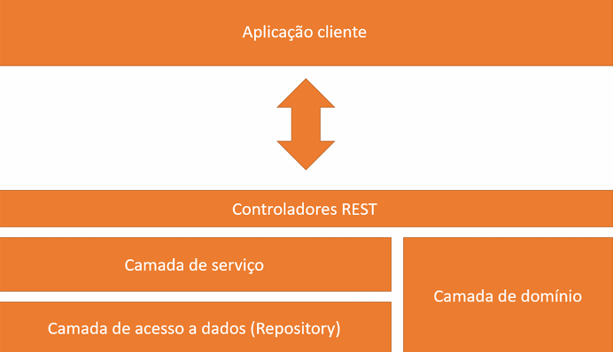
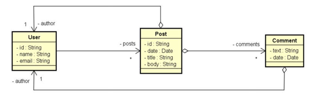
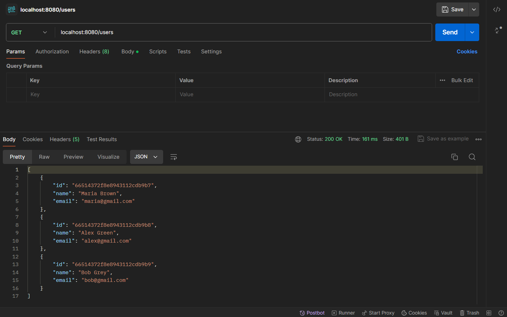
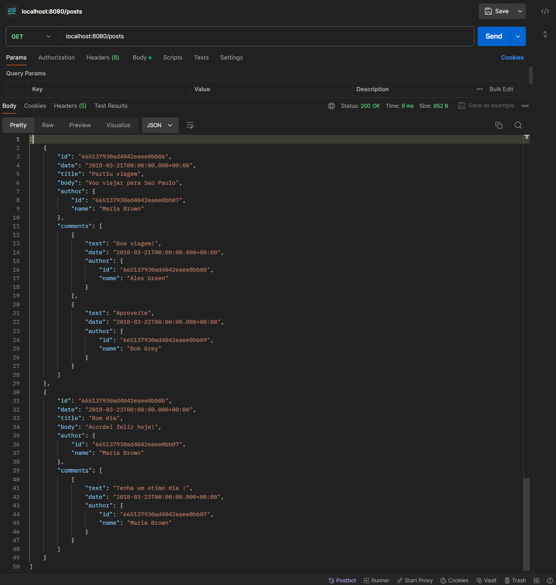

# workshop-springboot-mongodb

## Camadas do Projeto

  

Descrição: 
* Domínio: Classes principais (entidades)
* Acesso à banco de dados: Interfaces que implementam a interface MongoRepository para herdar métodos básicos de pesquisa;
* Serviços: Classe que implementa a interface referente ao banco de dados de cada entidade;
* Camada REST: Dedicada somente para tratamento das pesquisas web e aplicando métodos do banco de dados já validados nas classes de serviços;

## Modelagem

  

## Instancias

### Usuários

  

### Posts

  

## Tecnologias Utilizadas

- **Spring Boot**: Framework para desenvolvimento de aplicativos Java.
- **MongoDB Compass**: Ferramenta de administração para MongoDB.
- **Postman**: Plataforma para testar APIs.

OBS.: Projeto realizado através do curso https://www.udemy.com/share/1013hw3@TENABLv70VzogDwYZLQYBDdHoximjmZ4nI05OrfsJ0VPX_QMM-FxvO8jFb_qNWBl4g==/
